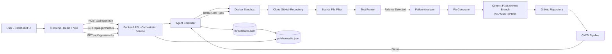

# Autonomous CI/CD Healing Agent

AI-driven system that accepts a GitHub repository URL, analyzes source files in a Docker sandbox, executes a LangGraph multi-agent remediation flow, and shows run metrics/fixes in a React dashboard.

## Deployment URL

- Backend callback base (active in workflow): `https://autonomous-ci-cd-healing-agent.onrender.com`
- Frontend deployed on vercel - `https://autonomous-ci-cd-healing-agent.vercel.app`

## LinkedIn Demo Video URL

- Add your demo video link: `https://www.linkedin.com/posts/kushagra-garg-a84013336_rift2026-hackathonexperience-systemthinking-activity-7430428391641776129-NqYQ?utm_source=social_share_send&utm_medium=android_app&rcm=ACoAAFRdC0QBZfdoyAdAKxiwpnjuSPN79se-QKY&utm_campaign=copy_link`

## Architecture Diagram



## Project Structure

- `frontend/` - Primary dashboard frontend (active UI)
- `backend/` - Express API and LangGraph multi-agent orchestration
- `runs/` - Per-run `results.json` artifacts
- `public/results.json` - Latest mirrored run result for UI consumption
- `src/` - Legacy root frontend code (not canonical dashboard target)

## Installation Instructions

From the repository root:

```bash
npm install
```

## Environment Setup

Create a `.env` file at repo root (or configure equivalent environment variables):

```bash
PORT=8080
AGENT_RETRY_LIMIT=5
GITHUB_TOKEN=<your_github_token>
SANDBOX_ALLOW_MOCK=true
```

Prerequisites:

- Node.js 18+
- npm 9+
- Docker installed and running
- GitHub token with permission to trigger workflow dispatch (for sandbox execution)

## Usage Examples

### Start development servers

```bash
npm run dev
```

This starts:

- backend server (`npm run dev:server`)
- frontend app from `frontend/` (`npm run dev:client`)

### Build frontend

```bash
npm run build
```

### Trigger a run via API

```bash
curl -X POST http://localhost:8080/api/agent/runs \
	-H "Content-Type: application/json" \
	-d '{"repoUrl":"https://github.com/example/repo","teamName":"DemoTeam","leaderName":"DemoLead"}'
```

### Check run status/result

```bash
curl http://localhost:8080/api/agent/runs/<runId>
curl http://localhost:8080/api/agent/runs/<runId>/results
```

## Supported Bug Types

Based on generated run artifacts (`runs/*/results.json`), current bug categories include:

- `LINTING`
- `SYNTAX`
- `LOGIC`
- `TYPE_ERROR`
- `IMPORT`
- `INDENTATION`

## Tech Stack

- Frontend: React, Vite, Tailwind CSS, Framer Motion, Recharts
- Backend: Node.js, Express, TypeScript (`tsx` runtime)
- Orchestration/AI: LangGraph (`@langchain/langgraph`)
- State and tooling: Zustand, Concurrently, PostCSS
- Runtime dependencies: Docker sandbox + GitHub workflow dispatch integration

## API Endpoints

- `GET /api/agent/health`
- `POST /api/agent/runs`
- `GET /api/agent/runs/:runId`
- `GET /api/agent/runs/:runId/results`

## Known Limitations

- Docker must be installed and running for repository analysis.
- Requires valid `GITHUB_TOKEN` and reachable GitHub workflow dispatch/callback flow.
- In-memory run store (`Map`) is reset on backend restart.
- Single latest result mirror (`public/results.json`) is overwritten each run.
- Frontend currently assumes backend is available at `http://localhost:8080` in dev.
- Without `GITHUB_TOKEN`, localhost runs in mock sandbox mode by default (`SANDBOX_ALLOW_MOCK=true`).

## Troubleshooting (Localhost)

### Error: `Sandbox dispatch failed. Missing required environment variable: GITHUB_TOKEN`

1. Ensure `.env` exists in the repo root.
2. Add a valid token:

```bash
GITHUB_TOKEN=<your_github_personal_access_token>
```

3. Restart the backend (`npm run dev` or `npm run dev:server`).
4. Confirm health endpoint works: `http://localhost:8080/api/agent/health`.

## Team Members

  final hackathon submission roster:

- Tanisha Mandavia (Team Leader)
- Kushagra Garg
